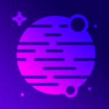

# Daily Space Palette

This is a web app that fetches the Astronomy Picture of the Day using [NASA's APOD API](https://api.nasa.gov/?ref=public-apis#browseAPI), then generates a color palette from that picture.

With this project, I hope to offer designers and developers an automatically generated color palette that contains colors from the Astronomy Picture of the Day.

## Built With:
- 
- 
- 
- `APOD API` - to fetch the [Astronomy Picture of the Day](https://apod.nasa.gov/apod/astropix.html) and its details.
- `node-vibrant` - to [generate the color palette](https://github.com/Vibrant-Colors/node-vibrant).

## Features to be added:
- Currently, the image displayed on the page is a *lower* resolution of the original. There will be an option to view the HD version of the image.
- There is only a single palette generated from the image, which acts as the primary palette. However, I plan to add multiple palettes that will originate from the original color palette to offer alternatives.

## Credits
- Background gradient generated with [Gradient Animator](https://www.gradient-animator.com/) by [Ian Forrest](https://medium.com/@jensaxena/css-tutorial-animated-geometric-galaxy-background-ad3835c36ce1)
- App icon (edited for this app) provided by [SVG Repo](https://www.svgrepo.com/svg/222146/planet-space) under [CC0 License](https://www.svgrepo.com/page/licensing)
